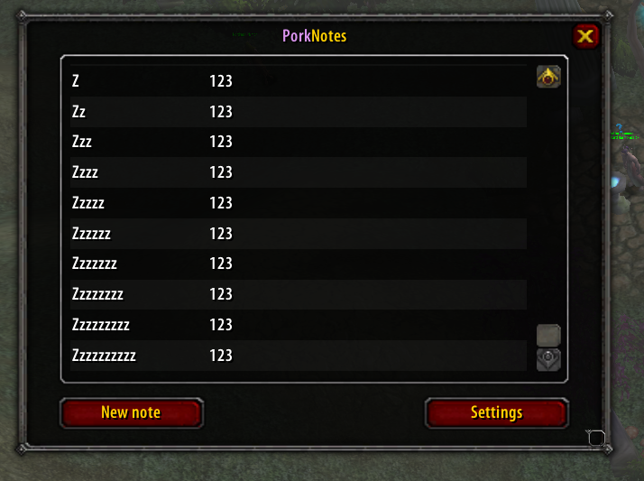
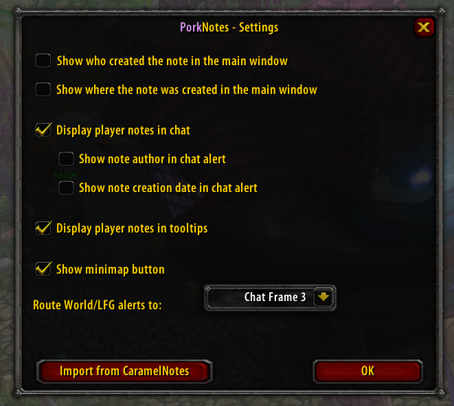
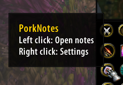

# PorkNotes

Write notes about other players.

A plugin for TurtleWoW (1.12 / Lua 5.0).

Based on [CaramelNotes](https://github.com/MrToffee/CaramelNotes) by MrToffee.

## Installation

### GitAddonsManager

1. Open GitAddonsManager and click the + to download an addon from a git repository.
2. Paste the git link to this repository into the prompt. (https://github.com/porkfriedlumpia/PorkNotes.git)
3. Press OK and the addon will download automatically to your AddOns directory.
4. Log in and type `/pn` or `/porknotes` to open

### Manual installation

1. Download and extract the zip
2. Rename the folder to `PorkNotes` if it isn't already
3. Place the `PorkNotes` folder in your `Interface/AddOns` directory
4. Log in and type `/pn` or `/porknotes` to open

## Commands

- `/porknotes` or `/pn` — Open the notes window
- `/pn import` — Import notes from CaramelNotes

## Features

- Write and store notes for any player
- Notes appear in player tooltips on hover
- Chat alerts when a noted player sends a message, with a clickable link to edit their note
- Right-click any player to add or edit their note
- Minimap button for quick access — left click opens notes, right click opens settings
- World and LookingForGroup channel alerts route to a configurable chat frame
- Settings window to toggle tooltip display, chat alerts, note author and timestamp in alerts, and metadata display in the main window

## Importing from CaramelNotes

If you have existing notes in CaramelNotes you can import them into PorkNotes in a few steps:

1. Download and install the CaramelNotes compatibility release: [CaramelNotes 1.3.1](https://github.com/porkfriedlumpia/PorkNotes/archive/refs/tags/CaramelNotes.zip)
2. Extract the folder to your AddOns directory and rename it to `CaramelNotes`
3. Make sure both PorkNotes and CaramelNotes are enabled in your addon list
4. Log in to the game
5. Type `/pn import` in chat, or click **Import from CaramelNotes** in the PorkNotes settings window
6. Your notes will be imported — any players you already have notes for in PorkNotes will be skipped
7. Once the import is complete you can disable or uninstall CaramelNotes

## Images

### Main window (`/pn or /porknotes`)

### Right-click menu on players

### Note alerts in chat

### Settings window

### Minimap button

## Credits

- Original addon [CaramelNotes](https://github.com/MrToffee/CaramelNotes) by MrToffee
