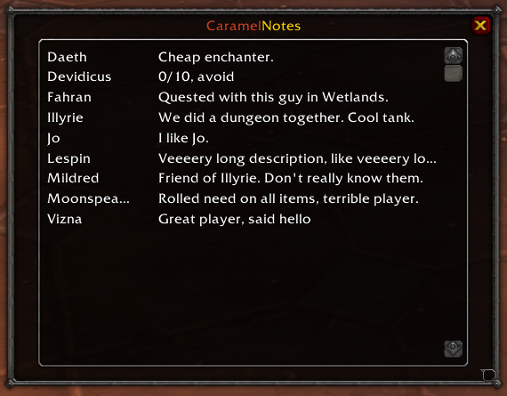
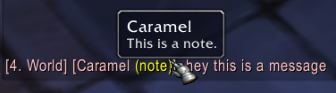

# PorkNotes

Write notes about other players.

A plugin for Vanilla WoW (1.12).
Compatible with TurtleWoW.

Heavily inspired by [Character Notes](https://www.curseforge.com/wow/addons/character-notes).
Original branch contains version 1.31 of CaramelNotes.
Addon originally created by MrToffee.

## Downloads

#### URL for addon managers

- Vanilla WoW (1.12) : https://github.com/porkfriedlumpia/pork-notes.git

#### Manual installation

- Vanilla WoW (1.12) : [CaramelNotes-main.zip](https://github.com/porkfriedlumpia/pork-notes/archive/refs/heads/main.zip) (rename the folder to `CaramelNotes`!)

## Screenshots

### Main window (`/notes`)

### Right-click menu option on players

### Notes in chat

